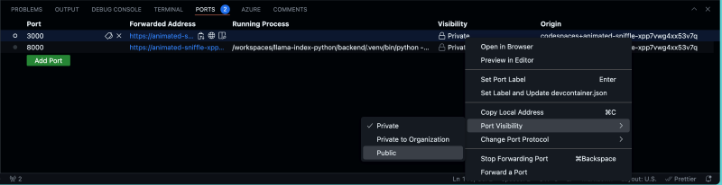

<!-- YAML front-matter schema: https://review.learn.microsoft.com/en-us/help/contribute/samples/process/onboarding?branch=main#supported-metadata-fields-for-readmemd -->

# Creative Writing Assistant: Working with Agents using Prompty (Python Implementation) 

[](https://codespaces.new/Azure-Samples/contoso-creative-writer) [](https://vscode.dev/redirect?url=vscode://ms-vscode-remote.remote-containers/cloneInVolume?url=https://github.com/azure-samples/contoso-creative-writer) 

## Table of Contents

- [Features](#features)
- [Azure account requirements](#azure-account-requirements)
- [Getting Started](#getting-started)
    - [GitHub Codespaces](#github-codespaces)
    - [VS Code Dev Containers](#vs-code-dev-containers)
    - [Local environment](#local-environment)
      - [Prerequisites](#prerequisites)
      - [Initializing the project](#initializing-the-project)
- [Deployment](#deployment)
- [Testing the sample](#testing-the-sample)
    - [Evaluating prompt flow results](#evaluating-prompt-flow-results)
- [Guidance](#guidance)
    - [Region Availability](#region-availability)
    - [Costs](#costs)
    - [Security Guidelines](#security)
- [Resources](#resources)
- [Code of Conduct](#code-of-conduct)


Contoso Creative Writer is an app that will help you write well researched, product specific articles. Enter the required information and then click "Start Work". To watch the steps in the agent workflow select the debug button in the bottom right corner of the screen. The result will begin writing once the agents complete the tasks to write the article.

This sample demonstrates how to create and work with AI agents driven by [Azure OpenAI](https://learn.microsoft.com/en-us/azure/ai-services/openai/). It includes a FastAPI app that takes a topic and instruction from a user and then calls a research agent that uses the [Bing Search API](https://www.microsoft.com/en-us/bing/apis/bing-web-search-api) to research the topic, a product agent that uses [Azure AI Search](https://azure.microsoft.com/en-gb/products/ai-services/ai-search) to do a semantic similarity search for related products from a vector store, a writer agent to combine the research and product information into a helpful article, and an editor agent to refine the article that's finally presented to the user.

## Features

This project template provides the following features:

* [Azure OpenAI](https://learn.microsoft.com/en-us/azure/ai-services/openai/) to drive the various agents
* [Prompty](https://prompty.ai/) to create, manage and evaluate the prompt into our code.
* [Bing Search API](https://www.microsoft.com/en-us/bing/apis/bing-web-search-api) to research the topic provided
* [Azure AI Search](https://azure.microsoft.com/en-gb/products/ai-services/ai-search) for performing semantic similarity search
  


## Azure account requirements

**IMPORTANT:** In order to deploy and run this example, you'll need:

* **Azure account**. If you're new to Azure, [get an Azure account for free](https://azure.microsoft.com/free/cognitive-search/) and you'll get some free Azure credits to get started. See [guide to deploying with the free trial](docs/deploy_lowcost.md).
* **Azure subscription with access enabled for the Azure OpenAI Service**. You can request access with [this form](https://aka.ms/oaiapply). If your access request to Azure OpenAI Service doesn't match the [acceptance criteria](https://learn.microsoft.com/legal/cognitive-services/openai/limited-access?context=%2Fazure%2Fcognitive-services%2Fopenai%2Fcontext%2Fcontext), you can use [OpenAI public API](https://platform.openai.com/docs/api-reference/introduction) instead.
    - Ability to deploy `gpt-35-turbo-0613`,`gpt-4-1106-Preview` and `gpt-4o-2024-05-13`.
    - We recommend using Canada East, as this region has access to all models and services required. 
* **Azure subscription with access enabled for [Bing Search API](https://www.microsoft.com/en-us/bing/apis/bing-web-search-api)**
* **Azure subscription with access enabled for [Azure AI Search](https://azure.microsoft.com/en-gb/products/ai-services/ai-search)**

## Getting Started

You have a few options for setting up this project.
The easiest way to get started is GitHub Codespaces, since it will setup all the tools for you, but you can also [set it up locally](#local-environment).

### GitHub Codespaces

1. You can run this template virtually by using GitHub Codespaces. The button will open a web-based VS Code instance in your browser:
   
    [](https://codespaces.new/Azure-Samples/agent-openai-python-prompty)

2. Open a terminal window.
3. Sign in to your Azure account. You'll need to login to both the Azure Developer CLI and Azure CLI:

    i. First with Azure Developer CLI 

    ```shell
    azd auth login
    ```

    ii. Then sign in with Azure CLI 
    
    ```shell
    az login --use-device-code
    ```

4. Provision the resources and deploy the code:

    ```shell
    azd up
    ```

    You will be prompted to select some details about your deployed resources, including location. As a reminder we recommend Canada East as the region for this project.
    Once the deployment is complete you should be able to scroll up in your terminal and see the url that the app has been deployed to. It should look similar to this 
    `Ingress Updated. Access your app at https://env-name.codespacesname.eastus2.azurecontainerapps.io/`. Navigate to the link to try out the app straight away! 

5. Once the above steps are completed you can [test the sample](#testing-the-sample). 

### VS Code Dev Containers

A related option is VS Code Dev Containers, which will open the project in your local VS Code using the [Dev Containers extension](https://marketplace.visualstudio.com/items?itemName=ms-vscode-remote.remote-containers):

1. Start Docker Desktop (install it if not already installed)
2. Open the project:
   
    [](https://vscode.dev/redirect?url=vscode://ms-vscode-remote.remote-containers/cloneInVolume?url=https://github.com/Azure-Samples/agent-openai-python-prompty.git)

3. In the VS Code window that opens, once the project files show up (this may take several minutes), open a terminal window.

4. Install required packages:

    ```shell
    cd src/api
    pip install -r requirements.txt
    ```
   Once you've completed these steps jump to [deployment](#deployment). 

### Local environment

#### Prerequisites

* [Azure Developer CLI (azd)](https://aka.ms/install-azd)
* [Python 3.10+](https://www.python.org/downloads/)
* [Docker Desktop](https://www.docker.com/products/docker-desktop/)
* [Git](https://git-scm.com/downloads)

**Note for Windows users:** If you are not using a container to run this sample, our hooks are currently all shell scripts. To provision this sample correctly while we work on updates we recommend using [git bash](https://gitforwindows.org/). 

#### Initializing the project

1. Create a new folder and switch to it in the terminal, then run this command to download the project code:

    ```shell
    azd init -t agent-openai-python-prompty
    ```
    Note that this command will initialize a git repository, so you do not need to clone this repository.

2. Install required packages:

    ```shell
    cd src/api
    pip install -r requirements.txt
    ```

## Deployment

Once you've opened the project in [Codespaces](#github-codespaces), [Dev Containers](#vs-code-dev-containers), or [locally](#local-environment), you can deploy it to Azure.

1. Sign in to your Azure account. You'll need to login to both the Azure Developer CLI and Azure CLI:

    i. First with Azure Developer CLI 

    ```shell
    azd auth login
    ```

    ii. Then sign in with Azure CLI 
    
    ```shell
    az login --use-device-code
    ```

    If you have any issues with that command, you may also want to try `azd auth login --use-device-code`.

    This will create a folder under `.azure/` in your project to store the configuration for this deployment. You may have multiple azd environments if desired.

2. Provision the resources and deploy the code:

    ```shell
    azd up
    ```

    This project uses `gpt-35-turbo-0613`,`gpt-4-1106-Preview` and `gpt-4o-2024-05-13` which may not be available in all Azure regions. Check for [up-to-date region availability](https://learn.microsoft.com/azure/ai-services/openai/concepts/models#standard-deployment-model-availability) and select a region during deployment accordingly. We recommend using Canada East for this project.

   After running azd up, you may be asked the following question during `Github Setup`:

   ```shell 
   Do you want to configure a GitHub action to automatically deploy this repo to Azure when you push code changes?
   (Y/n) Y
   ```

   You should respond with `N`, as this is not a necessary step, and takes some time to set up. 


## Testing the sample

This sample repository contains an agents folder that includes subfolders for each agent. Each agent folder contains a prompty file where the agent's prompty is defined and a python file with the code used to run it. Exploring these files will help you understand what each agent is doing. The agent's folder also contains an `orchestrator.py` file that can be used to run the entire flow and to create an article. When you ran `azd up` a catalogue of products was uploaded to the Azure AI Search vector store and index name `contoso-products` was created. 

To test the sample: 

1. Run the example web app locally using a FastAPI server. 

    First navigate to the src/api folder 
    ```shell
    cd ./src/api
    ```

    Run the FastAPI webserver
    ```shell
    fastapi dev main.py
    ```
    
    **Important Note**: If you are running in Codespaces, you will need to change the visibility of the API's 8000 and 5173 ports to `public` in your VS Code terminal's `PORTS` tab. The ports tab should look like this:

    


    If you open the server link in a browser, you will see a URL not found error, this is because we haven't created a home url route in FastAPI. We have instead created a `/get_article` route which is used to pass context and instructions directly to the get_article.py file which runs the agent workflow.

   (Optional) We have created a web interface which we will run next, but you can test the API is working as expected by running this in the browser:
    ```
    http://127.0.0.1:8080/get_article?context=Write an article about camping in alaska&instructions=find specifics about what type of gear they would need and explain in detail
    ```

3. Once the FastAPI server is running you can now run the web app. To do this open a new terminal window and navigate to the web folder using this command:
    ```shell
    cd ./src/web
    ```
    
    First install node packages:
    ```shell
    npm install
    ```

    Then run the web app with a local dev web server:
    ```shell
    npm run dev
    ```

    This will launch the app, where you can use example context and instructions to get started. 
    On the 'Creative Team' page you can examine the output of each agent by clicking on it. The app should look like this:

    Change the instructions and context to create an article of your choice. 

4. For debugging purposes you may want to test in Python using the orchestrator Logic

    To run the sample using just the orchestrator logic use the following command:

    ```shell
    cd ./src/api
    python -m orchestrator

    ```

## Tracing

To activate the Prompty tracing server:

```
export LOCAL_TRACING=true
```

Then start the orchestrator:

```
cd ./src/api
python -m orchestrator
```

Once you can see the article has been generated, a `.runs` folder should appear in the `./src/api` . Select this folder and click the `.tracy` file in it. 
This shows you all the Python functions that were called in order to generate the article. Explore each section and see what helpful information you can find.

## Evaluating prompt flow results

To understand how well our prompt flow performs using defined metrics like **groundedness**, **coherence** etc we can evaluate the results. To evaluate the prompt flow, we need to be able to compare it to what we see as "good results" in order to understand how well it aligns with our expectations. 

We may be able to evaluate the flow manually (e.g., using Azure AI Studio) but for now, we'll evaluate this by running the prompt flow using **gpt-4** and comparing our performance to the results obtained there. To do this, follow the instructions and steps in the notebook `evaluate-chat-prompt-flow.ipynb` under the `eval` folder.

You can also view the evaluation metrics by running the following command from the src/api folder. 

Run evaluation:

```shell
cd ./src/api
python -m evaluate.evaluate
```

## Setting up CI/CD with GitHub actions

This template is set up to run CI/CD when you push changes to your repo. When CI/CD is configured, evaluations will in GitHub actions and then automatically deploy your app on push to main.

To set up CI/CD with GitHub actions on your repository, run the following command:
```shell
azd pipeline config
```

## Guidance

### Region Availability

This template uses `gpt-35-turbo-0613`,`gpt-4-1106-Preview` and `gpt-4o-2024-05-13` which may not be available in all Azure regions. Check for [up-to-date region availability](https://learn.microsoft.com/azure/ai-services/openai/concepts/models#standard-deployment-model-availability) and select a region during deployment accordingly
  * We recommend using Canada East

### Costs

You can estimate the cost of this project's architecture with [Azure's pricing calculator](https://azure.microsoft.com/pricing/calculator/)

* **Azure subscription with access enabled for [Bing Search API](https://www.microsoft.com/en-us/bing/apis/bing-web-search-api)**
* **Azure subscription with access enabled for [Azure AI Search](https://azure.microsoft.com/en-gb/products/ai-services/ai-search)**

### Security

> [!NOTE]
> When implementing this template please specify whether the template uses Managed Identity or Key Vault

This template has either [Managed Identity](https://learn.microsoft.com/entra/identity/managed-identities-azure-resources/overview) or Key Vault built in to eliminate the need for developers to manage these credentials. Applications can use managed identities to obtain Microsoft Entra tokens without having to manage any credentials. Additionally, we have added a [GitHub Action tool](https://github.com/microsoft/security-devops-action) that scans the infrastructure-as-code files and generates a report containing any detected issues. To ensure best practices in your repo we recommend anyone creating solutions based on our templates ensure that the [Github secret scanning](https://docs.github.com/code-security/secret-scanning/about-secret-scanning) setting is enabled in your repos.

## Resources

* [Prompty Documentation](https://prompty.ai/)
* [Develop Python apps that use Azure AI services](https://learn.microsoft.com/azure/developer/python/azure-ai-for-python-developers)

## Code of Conduct

This project has adopted the [Microsoft Open Source Code of Conduct](https://opensource.microsoft.com/codeofconduct/).

Resources:

- [Microsoft Open Source Code of Conduct](https://opensource.microsoft.com/codeofconduct/)
- [Microsoft Code of Conduct FAQ](https://opensource.microsoft.com/codeofconduct/faq/)
- Contact [opencode@microsoft.com](mailto:opencode@microsoft.com) with questions or concerns

For more information see the [Code of Conduct FAQ](https://opensource.microsoft.com/codeofconduct/faq/) or
contact [opencode@microsoft.com](mailto:opencode@microsoft.com) with any additional questions or comments.

## Responsible AI Guidelines

This project follows below responsible AI guidelines and best practices, please review them before using this project:

- [Microsoft Responsible AI Guidelines](https://www.microsoft.com/en-us/ai/responsible-ai)
- [Responsible AI practices for Azure OpenAI models](https://learn.microsoft.com/en-us/legal/cognitive-services/openai/overview)
- [Safety evaluations transparency notes](https://learn.microsoft.com/en-us/azure/ai-studio/concepts/safety-evaluations-transparency-note)
