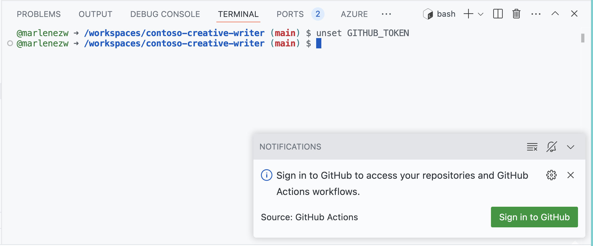

# WRK551 Build a multi-tasking assistant with Azure OpenAI

## Welcome to workshop WRK551!

Building Large Language Model (LLM) applications​ is hard! Companies want to build AI solutions, but how can they do this in a reliable, reproducible and observable way?​

### Challenges with AI:  ​
- Getting LLM apps to work with various real world inputs ​
- Debugging (local and production)​ to understand failures
- Setting up and managing production infrastructure automation

This workshop will introduce new tooling that provides practical solutions to these problems. 

## Part 1: Setting Up

These are instructions for the insructor led AI Tour session, you should have the Skillable Lab Manual open in a different tab.

1. Open a terminal window (this is likely already done for you.)

2. We'll begin by logging into the Github CLI so we can fork the repository and make changes to the code comfortably.

    i. Remove any existing Github tokens, so Github CLI can authenticate: 

    ```shell
    unset GITHUB_TOKEN
    ```

    ii. A notification should come up at the bottom right of your screen, that looks like the one in the image below. 
    - If it dissapears click the bell🔔 icon and you should see it again. 
    - Select **Sign into Github**
    - Then select **Allow**

    


    ii. Login to Github CLI with the following command and complete through the login workflow. 
    - When you have run the command answer the questions as follows:  
    - What account do you want to log into? **GitHub.com**
    - What is your preferred protocol for Git operations on this host? **HTTPS**
    - Authenticate Git with your GitHub credentials? **Y**
    - How would you like to authenticate GitHub CLI? **Login with a web browser**

    ```shell
    gh auth login
    ```

    iii. Fork the repository.
    - Choose `Yes` when you are asked if you'd like to add a remote fork

    ```shell
    gh repo fork
    ```

Next we will login to Azure Developer CLI (azd) and Azure CLI (az).
<br>**Note:** If you get an error trying to sign in to either, rerun the command to try again. 

3. Sign in to Azure Developer CLI. 
    - Use the `username` and `password` from the lab manual when prompted to sign in with an email and password.

    ```shell
    azd auth login --use-device-code
    ```

4.  Then sign in with Azure CLI. 
    - Again, use the `username` and `password` from the lab manual. 
    - Press enter to select the default subscription when prompted.
    
    ```shell
    az login --use-device-code
    ```

5.  Get the environment variables for your resource group.
    - Run the below command, **replacing `AzureEnvName`** with the value given for it in the lab manual. (It should look something like AITOUR12345678)
    - When prompted select `Y` to create the environment
    - Press enter to select the default subscription. 
    - Finally choose the location **Canada East**
    
    ```shell
    azd env refresh -e AzureEnvName
    ```

6. Save the environment variables to a .env file. 

    ```shell
    azd env get-values > .env
    ```

7. Set the correct roles by running the roles bash script. 
    ```shell
    bash infra/hooks/roles.sh
    ```

8. Run the postprovision script 
    - Make sure to **Replace `AzureEnvName`** with the value given for it in the lab manual. 
    - This might take a while but should not take more than 5mins.

    ```shell
    azd hooks run postprovision -e AZDEnvName
    ```

➡️ **While you wait move on to part 2 and get started with [workshop-1-intro.ipynb](workshop-1-intro.ipynb)!** 
 
## Part 2: Understanding and Building Contoso Creative Writer

### Learning Outcomes
In this section we will focus on four key outcomes, each split into their own notebook:

1. [Understanding agents and prompt engineering with Prompty.](./workshop-1-intro.ipynb)
2. [Utilizing Prompty tracing for debugging and observability.](./workshop-2-tracing.ipynb)
3. [Building and running Contoso Creative Writer.](./workshop-3-build.ipynb)
4. [Setting up automated evaluations with GitHub Actions.](./workshop-4-ci-cd.ipynb)

Open the [workshop-1-intro.ipynb](workshop-1-intro.ipynb) file to begin the first learning outcome!  
